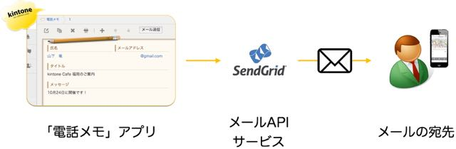

## Contents
* **kintone-Cafe-Tokyo-2-pack.zip**：「社員名簿」と「電話メモ」アプリテンプレート（パック）です。「電話メモ」には`sampleSendGridTemplate.js`が含まれていますので、適宜差し替えてください。

* **./plugins**：プラグイン群を保存するディレクトリです。パッケージングすると、配下に`keys`や`plugins`といったディレクトリが生成されます。

* **./plugins/sendmail**：今回のハンズオンの元になるSendGridを利用したメール送信プラグインのソースファイルです。`sampleSendGridTemplate.js`を元に作成してあります。

* **sampleSendGridTemplate.js**：「[kintone Café 福岡 Vol.3](http://www.slideshare.net/yamaryu0508b/kintone-caf-vol3kintone-javascriptkintoneproxysendgrid "kintone Café Fukuoka Vol.3 (presentation on Slideshare)")」でカスタマイズしたSendGridを利用したメール送信用JavaScriptファイルです。



## Download
```
$ git clone https://github.com/joyzo/kintone-Cafe-Tokyo-2.git
```
パッケージング用のシェルも含まれていますので、ダウンロード後パッケージングすればすぐにプラグインが得られます。

## Packaging
```
$ cd kintone-Cafe-Tokyo-2/plugins/
$ sh package.sh sendmail/

Plugin ID: lafhjdlhnppkipfcjaedidgfpdhjgjbm
Plugin file: /home/ubuntu/workspace/kintone-Cafe-Tokyo-2/plugins/plugins/lafhjdlhnppkipfcjaedidgfpdhjgjbm/plugin.zip
Private key file: /home/ubuntu/workspace/kintone-Cafe-Tokyo-2/plugins/keys/sendmail.lafhjdlhnppkipfcjaedidgfpdhjgjbm.ppk
```
kintoneに読み込むためのプラグインファイルは`plugin.zip`として`plugins`ディレクトリの配下に生成されます。

また、プラグインをアップデート提供するための`key file`は`keys`ディレクトリ配下に生成されます。

## Re-packaging
1度プラグインIDが採番されたプラグインをアップデート提供するためには、プラグインIDを維持し、パッケージングの際に`key file(.ppk)`を指定する必要があり、プラグインの一意性を保つ必要性があります（これをやらないと読み込み時に新しいプラグインとして認識され、アプリの設定も最初からやり直すことになります）。
```
$ sh package.sh sendmail/  keys/sendmail.lafhjdlhnppkipfcjaedidgfpdhjgjbm.ppk

Plugin ID: lafhjdlhnppkipfcjaedidgfpdhjgjbm
Plugin file: /home/ubuntu/workspace/kintone-Cafe-Tokyo-2/plugins/plugins/lafhjdlhnppkipfcjaedidgfpdhjgjbm/plugin.zip
Private key file: /home/ubuntu/workspace/kintone-Cafe-Tokyo-2/plugins/keys/sendmail.lafhjdlhnppkipfcjaedidgfpdhjgjbm.ppk
```

## Reference
* [kintone plugin リファレンス](https://cybozudev.zendesk.com/hc/ja/categories/200219390-kintone-plugin)（cybozu.com developer network内）
* [kintone plugin SDK](https://github.com/kintone/plugin-sdk)（GitHub/[kintone](https://github.com/kintone)内）
* [kintoneフィールド形式](https://cybozudev.zendesk.com/hc/ja/articles/202166330)（cybozu.com developer network内）
* [Cloud9で開発するkintoneプラグイン](https://www.joyzo.co.jp/blog/454)
* kintone Café Fukuoka Vol.3 (presentation on Slideshare) [[日本語](http://www.slideshare.net/yamaryu0508b/kintone-caf-vol3kintone-javascriptkintoneproxysendgrid "kintone Café Fukuoka Vol.3 (presentation on Slideshare)")]
* SendGrid APIドキュメント [[English](https://sendgrid.com/docs/API_Reference/Web_API/mail.html "SendGrid APIドキュメント")]
